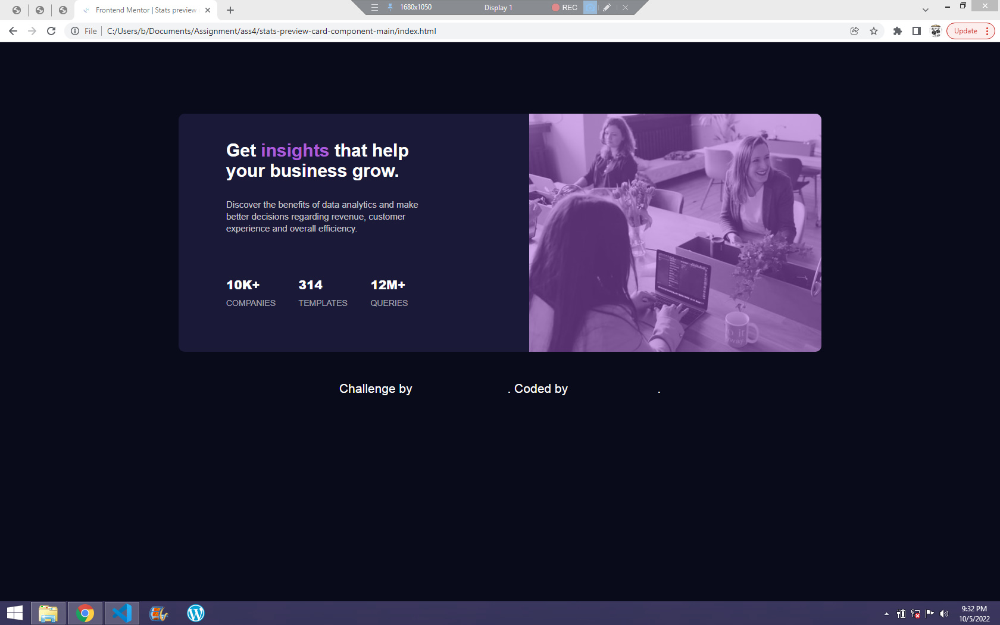

# Stats preview card  solution

This is my solution to the [Stats preview card component challenge on Frontend Mentor](https://www.frontendmentor.io/challenges/stats-preview-card-component-8JqbgoU62). Frontend Mentor challenges help you improve your coding skills by building realistic projects. 

## Overview

### The challenge

Users should be able to:

- View the optimal layout depending on their device's screen size

### Screenshot




### Links

- Solution URL: [Vercel](https://frontendmentorass4.vercel.app/)
- Live Site URL: [Github](https://github.com/Camoscript/frontendmentorass4)

## My process

### Built with
- CSS Flex-box
- HTML 5 Markup


### What I learned

It was very challenging to finish this project, especially making it responsive to mobile view.
But i learnt a new way of lining content using column-reverse flex direction.

```I really like this code
.card{
        flex-direction: column-reverse;
        margin:40px auto 0px;
        width: 300px;
        height: 700px;
    }
```

### Continued development

The next area I will continue to look into is the CSS grid system.
Now I am familiar with the CSS flex properties, it's time to move on to grid.


## Author

- Author - [Tobi Emmanuel]
- Frontend Mentor - [@Camoscript](https://www.frontendmentor.io/profile/Camoscript)
- Twitter - [@camoscript1](https://www.twitter.com/camoscript1)


## Acknowledgments
I reallty give thanks to God almighty for giving me strength to finish this assignment.